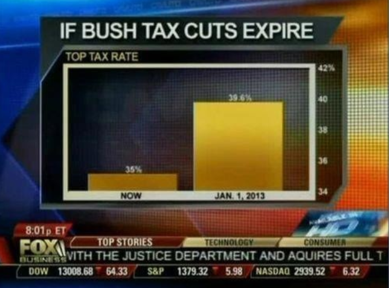
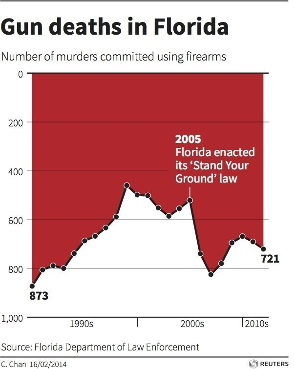

```{r setup, include=FALSE}
options(htmltools.dir.version = FALSE)
knitr::opts_chunk$set(cache = TRUE, message = FALSE, echo = FALSE,
                      fig.retina = 2, fig.align = "c")

set.seed(1234)
```

```{r, out.height = "80%"}

```

---

```{r, out.height = "80%", out.width = "80%"}

```

---

```{r, out.height = "70%", out.width = "80%"}
  
```

---

# Resources for data viz

- [Data Visualization: A Practical Introduction](https://socviz.co/)
- [Flowing Data](https://flowingdata.com/)
- [On Rational, Scientific, Objective Viewpoints from Mythical, Imaginary, Impossible Standpoints. From *Data Feminism*](https://data-feminism.mitpress.mit.edu/pub/5evfe9yd/release/3)
- Alberto Cairo
    - [*The Truthful Art*](http://www.thefunctionalart.com/p/the-truthful-art-book.html)
    - [*How Charts Lie*](http://www.thefunctionalart.com/p/reviews.html)


